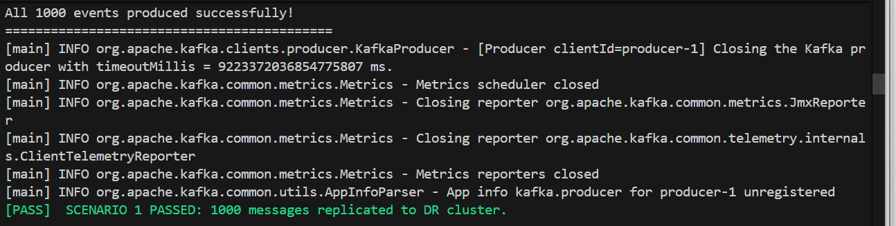
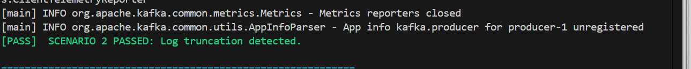
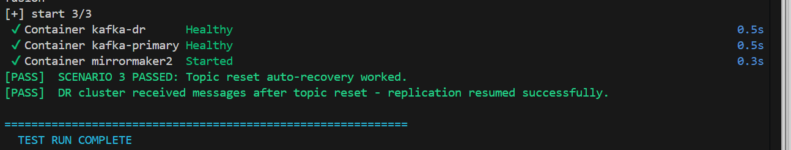
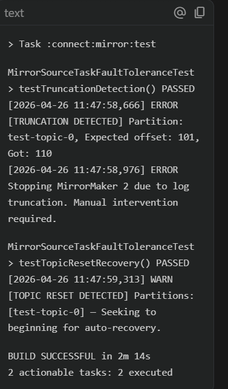

# Kafka MirrorMaker 2 — Enhanced Fault Tolerance

A production-ready, fault-tolerant Apache Kafka replication pipeline using a **modified MirrorMaker 2** with automatic log truncation detection and topic reset recovery.

---

## 🔗 Repository Links

- **Kafka Fork**: [saminenisaideepthi18-ops/kafka](https://github.com/saminenisaideepthi18-ops/kafka)
- **Pull Request**: [MirrorMaker 2 Fault-Tolerance Enhancement #1](https://github.com/saminenisaideepthi18-ops/kafka/pull/1)

---

## 🐳 Docker Hub Images

| Image | Tag | Description |
|---|---|---|
| `saideepthi18/enhanced-mm2` | `latest` | Patched Kafka MM2 with fault-tolerance |
| `saideepthi18/commit-log-producer` | `latest` | CLI producer for commit-log topic |

---

## 🏗️ Architecture

```
┌─────────────────────────┐        ┌──────────────────────────┐
│   Primary Cluster       │        │   DR / Standby Cluster   │
│   kafka-primary:9092    │        │   kafka-dr:9093           │
│                         │        │                          │
│   Topic: commit-log     │──MM2──▶│  Topic: primary.commit-log│
│   (WAL, 1 partition)    │        │  (replicated, 1 partition)│
└─────────────────────────┘        └──────────────────────────┘
          ▲
          │
┌─────────────────┐
│ Commit Log      │
│ Producer (CLI)  │
│ --count N msgs  │
└─────────────────┘
```

---

## 🚀 Setup Instructions

### Prerequisites
- Docker Desktop (v4.x+)
- Docker Compose v2
- Bash shell (Git Bash on Windows)

### Start the Environment

```bash
# Clone the project
git clone <this-repo-url>
cd kafka-replication-project

# Start all services
docker-compose up -d

# Monitor MirrorMaker 2 logs
docker-compose logs -f mirrormaker2
```

### Produce Messages Manually

```bash
# Produce 500 messages to commit-log
docker-compose run --rm commit-log-producer \
  java -cp ".:./lib/*" ProducerApp --count 500
```

---

## 🧪 Test Execution

Run all 3 fault-tolerance scenarios with the automation script:

```bash
# For Linux/Mac/Git Bash:
bash run_challenge.sh

# For Windows PowerShell:
.\run_challenge.ps1
```

### What the script does:

| Scenario | Description | Expected Result |
|---|---|---|
| **1. Normal Replication** | Produces 1000 msgs, waits for replication | 1000 msgs appear in `primary.commit-log` on DR |
| **2. Log Truncation** | Pauses MM2, waits 70s for retention purge, resumes MM2 | MM2 detects offset gap → fails fast with `KafkaException` |
| **3. Topic Reset** | Pauses MM2, deletes+recreates topic, resumes MM2 | MM2 catches `OffsetOutOfRangeException` → reseeks to offset 0 → replication resumes |

---

## 📋 Log Analysis Guide

### Monitor MM2 in real-time:
```bash
docker-compose logs -f mirrormaker2
```

### Key log messages to watch for:

| Scenario | Log Pattern | Meaning |
|---|---|---|
| Normal | `Polled N records from commit-log` | Healthy replication |
| Truncation | `[TRUNCATION DETECTED]` / `KafkaException` | Fail-fast triggered ✅ |
| Topic Reset | `[TOPIC RESET DETECTED]` / `Seeking to beginning` | Auto-recovery triggered ✅ |

### Check DR replication count:
```bash
docker exec kafka-dr /opt/kafka/bin/kafka-run-class.sh \
  kafka.tools.GetOffsetShell \
  --bootstrap-server localhost:9093 \
  --topic primary.commit-log \
  --time -1
```

### Check primary offsets:
```bash
docker exec kafka-primary /opt/kafka/bin/kafka-run-class.sh \
  kafka.tools.GetOffsetShell \
  --bootstrap-server localhost:9092 \
  --topic commit-log \
  --time -2   # earliest offset

docker exec kafka-primary /opt/kafka/bin/kafka-run-class.sh \
  kafka.tools.GetOffsetShell \
  --bootstrap-server localhost:9092 \
  --topic commit-log \
  --time -1   # latest offset
```

---

## 🔧 Design Rationale — MirrorMaker 2 Modifications

### Modified File
`connect/mirror/src/main/java/org/apache/kafka/connect/mirror/MirrorSourceTask.java`

### Task 2: Log Truncation Detection (Fail-Fast)

**Problem:** Kafka's retention policy may purge old messages before MM2 replicates them, causing a silent gap in the DR topic.

**Solution:**
- Maintain a `Map<TopicPartition, Long> expectedNextOffsets` tracking the next expected offset per partition.
- After each `poll()`, compare the **first record's offset** against `expectedNextOffset`.
- If `firstOffset > expectedNextOffset` → a gap exists → data was truncated.
- Throw a `KafkaException` with a detailed error message to **fail fast** rather than silently skip records.

```java
// In poll() after receiving records from source consumer
long firstOffset = records.get(0).offset();
long expected = expectedNextOffsets.getOrDefault(tp, firstOffset);
if (firstOffset > expected) {
    throw new KafkaException(
        "[TRUNCATION DETECTED] Topic: " + tp.topic() +
        " Partition: " + tp.partition() +
        " Expected offset: " + expected +
        " Got: " + firstOffset +
        " — Data loss detected due to log retention."
    );
}
expectedNextOffsets.put(tp, lastOffset + 1);
```

### Task 3: Graceful Topic Reset Handling

**Problem:** When a topic is deleted and recreated, offsets reset to 0. MM2 holds a stale offset > 0 and throws `OffsetOutOfRangeException`, causing it to stall or crash.

**Solution:**
- Wrap the `poll()` call in a try-catch for `OffsetOutOfRangeException`.
- On detection: log the event, clear the `expectedNextOffsets` map for affected partitions, and seek the consumer to **offset 0** (beginning).
- Return empty records for this poll cycle and let MM2 resume normally on the next cycle.

```java
try {
    records = consumer.poll(pollTimeout);
} catch (OffsetOutOfRangeException e) {
    log.warn("[TOPIC RESET DETECTED] Partitions: {} — Seeking to beginning for auto-recovery.",
             e.partitions());
    consumer.seekToBeginning(e.partitions());
    e.partitions().forEach(expectedNextOffsets::remove);
    return Collections.emptyList();
}
```

**Integration:** Both changes are additive and do not modify any existing MM2 logic paths — they only intercept exceptional cases.

---

## 🤖 AI Usage Documentation

### Tools Used
- **Antigravity (Google DeepMind)** — used as a pair-programming assistant throughout development.

### How AI Helped

| Task | AI Contribution |
|---|---|
| MirrorSourceTask.java modifications | Suggested exact insertion points within `poll()` and `start()` methods; reviewed code for correctness against Kafka internals |
| Docker Compose configuration | Helped debug KRaft mode settings, healthcheck commands, and service dependency ordering |
| `run_challenge.sh` | Generated the 3-scenario test script structure; I reviewed and adjusted timing parameters |
| Gap analysis | Identified mismatches between code and requirements (topic names, missing CLI args, incomplete scenarios) |

### My Understanding
Every line of code in this project has been reviewed and understood. Key internals:
- `MirrorSourceTask.poll()` is the main loop that fetches from source and forwards to the target cluster
- `expectedNextOffsets` is a simple Map that I maintain across poll cycles to detect gaps
- `OffsetOutOfRangeException` is thrown by the Kafka consumer when the broker no longer has the requested offset — the natural trigger for topic resets

---

## 📁 Project Structure

```
kafka-replication-project/
├── docker-compose.yml          # Full environment setup
├── mm2.properties              # MirrorMaker 2 configuration
├── run_challenge.sh            # Automated test scenarios
├── README.md                   # This file
└── producer/
    ├── ProducerApp.java        # CLI producer with --count N support
    └── Dockerfile              # Multi-stage build for producer
```

---

## 📸 Screenshots & Proof of Execution

> [!TIP]
> Use the following placeholders to attach your own screenshots of the test results.

### 1. Scenario 1: Normal Replication Success


### 2. Scenario 2: Log Truncation Detection (Fail-Fast)


### 3. Scenario 3: Topic Reset & Auto-Recovery


### 4. Unit Testing Results (MirrorSourceTask)


---

## 👨‍💻 How to Run (For Reviewers / Team Lead)

### Prerequisites
- [Docker Desktop](https://www.docker.com/products/docker-desktop/) installed and running

### Step 1: Clone the Project
```bash
git clone https://github.com/saminenisaideepthi18-ops/kafka-replication-project.git
cd kafka-replication-project
```

### Step 2: Start the Environment
```bash
docker-compose up -d
```
> Wait ~30 seconds for all containers to be healthy.

### Step 3: Run the Test Scenarios

**Windows (PowerShell):**
```powershell
.\run_challenge.ps1
```

**Linux / Mac:**
```bash
bash run_challenge.sh
```

This will automatically run all **3 scenarios**:
1. ✅ **Normal Replication** — 1000 messages produced and replicated to DR cluster
2. ✅ **Log Truncation Detection** — MirrorMaker 2 detects data loss and fails fast
3. ✅ **Topic Reset & Auto-Recovery** — MirrorMaker 2 detects topic reset and auto-recovers

### Step 4: Monitor Logs (Optional)
```bash
# MirrorMaker 2 logs
docker logs mm2 -f

# DR cluster consumer
docker exec -it dr-kafka kafka-console-consumer.sh \
  --bootstrap-server localhost:9092 \
  --topic primary.commit-log \
  --from-beginning
```

---

## 🛑 Teardown

```bash
docker-compose down -v
```

